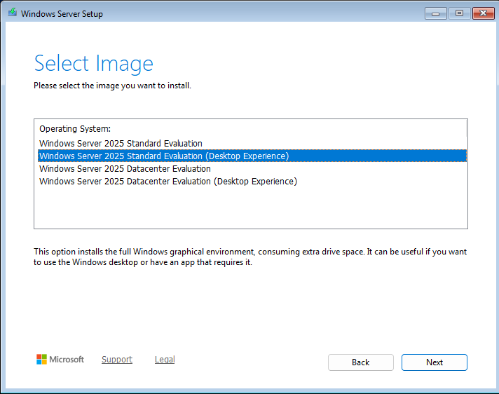
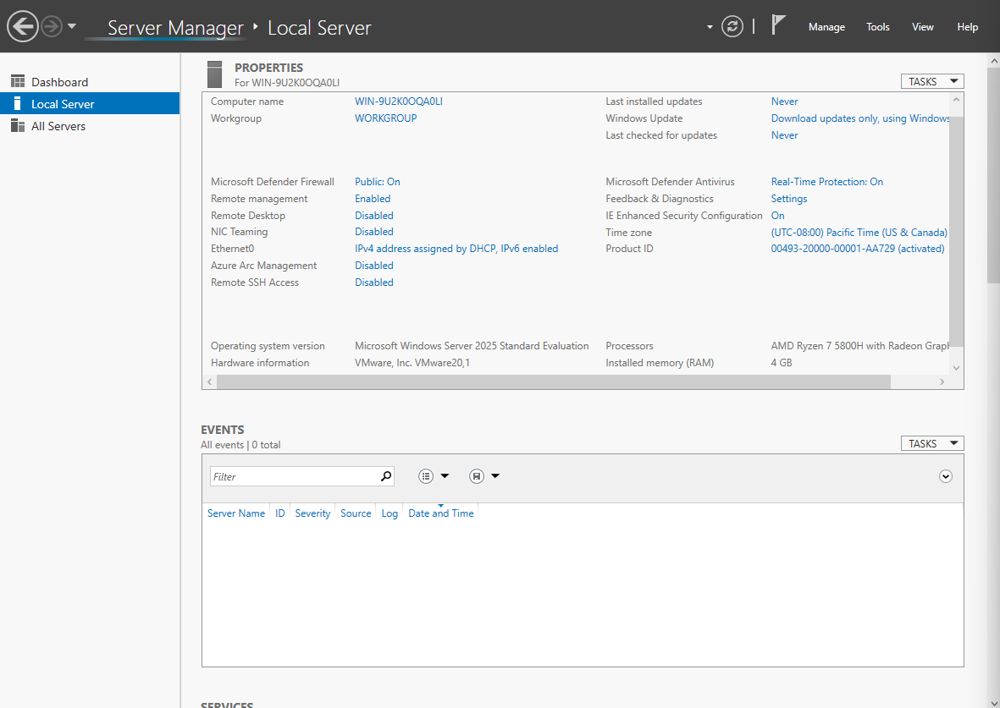
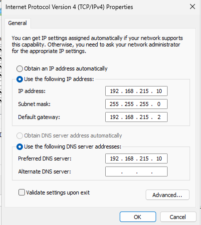

# Initial Server Configuration

## Objective

The objective of this stage was to deploy the virtual infrastructure required for the Active Directory lab.

---

## Environment

- Hypervisor: VMware Workstation
- Server Operating System: Windows Server 2025 Standard (Desktop Experience)
- Client Operating System: Windows 11 Enterprise
- Firmware: UEFI
- Network Adapter: NAT

The following screenshot shows the Windows Server edition selected during the installation.

---

## Virtual Machine Specifications

### Domain Controller (DC01)

- 4 GB RAM
- 4 vCPUs
- 60 GB NVMe virtual disk

### Client (CLIENT01)

- 4 GB RAM
- 2 vCPUs
- 60 GB NVMe virtual disk

---

## Initial Configuration

The following tasks were completed after installing Windows Server:

- Installed VMware Tools.
- Renamed the server to **DC01**.
- Configured a static IP address (`192.168.215.10`).
- Configured the preferred DNS server to point to itself.
- Verified network connectivity.

Initial server configuration before making any changes.

The server was then configured with a static IP address required for Active Directory.

---

## Result

The server was successfully prepared for the installation of Active Directory Domain Services.