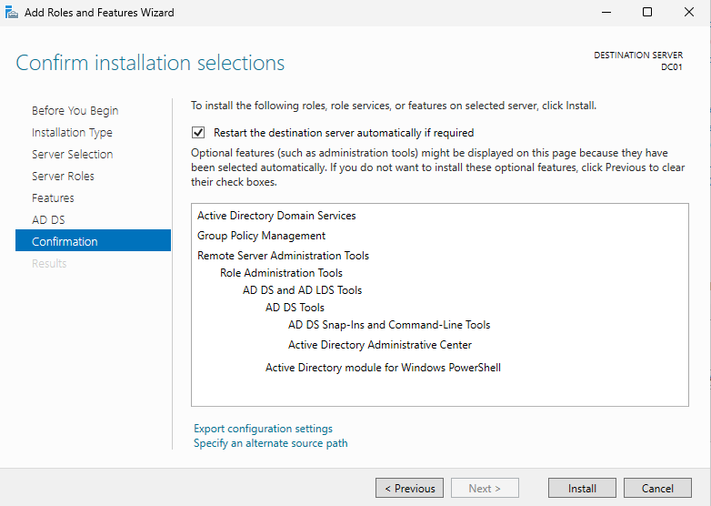
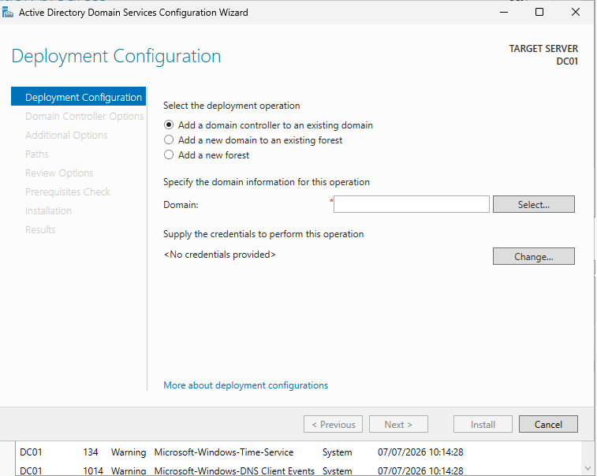
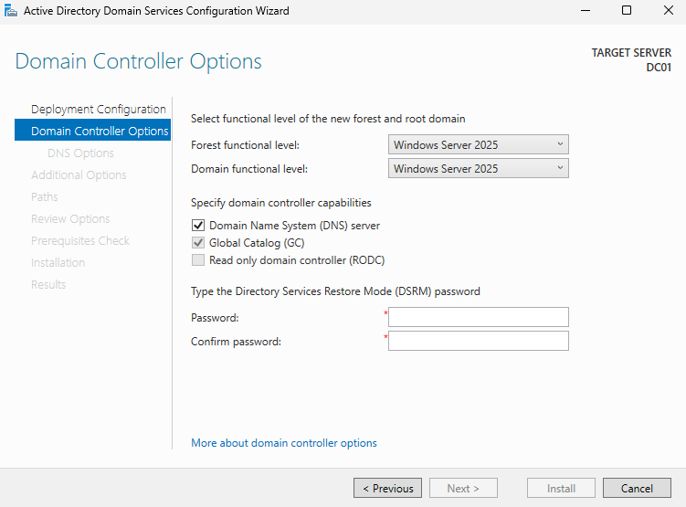
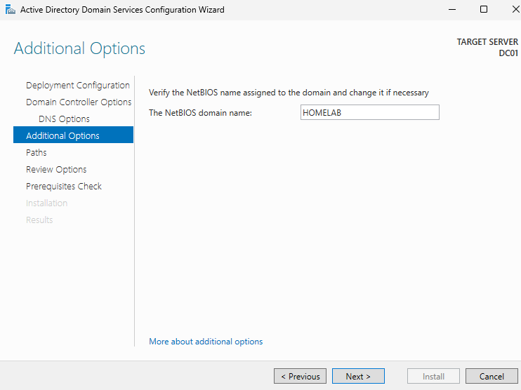
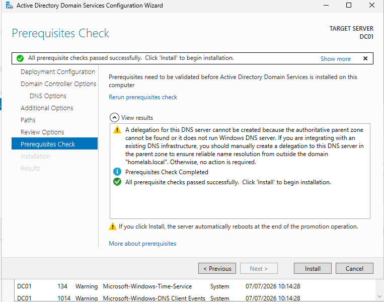
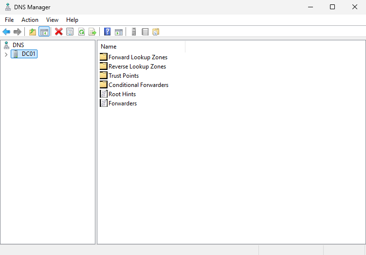

# Active Directory Deployment

## Objective

Deploy Active Directory Domain Services (AD DS) and promote the server to a Domain Controller.

---

## Configuration

The server was promoted as the first Domain Controller of a new forest.

The Active Directory Domain Services role was installed using Server Manager.

A new Active Directory forest named **homelab.local** was created.

During the promotion process, the Domain Controller options were configured.

### Domain Information

- Forest: homelab.local
- Domain: homelab.local
- NetBIOS Name: HOMELAB
- Domain Controller: DC01

The default NetBIOS name was automatically assigned during the domain creation.

---

## Installed Roles

- Active Directory Domain Services (AD DS)
- DNS Server

Before promoting the server, Windows successfully completed all prerequisite checks.

After the promotion, the DNS Manager confirmed that the DNS zone had been created correctly.

---

## Validation

The deployment was verified by confirming:

- The server successfully rebooted after promotion.
- Active Directory Users and Computers console was available.
- DNS zone was created automatically.
- The server was operating as the Domain Controller.

---

## Result

A fully functional Active Directory domain was successfully deployed.