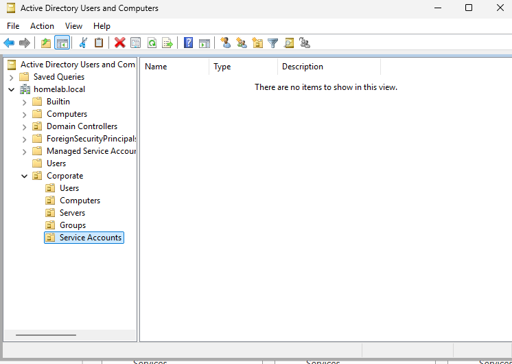
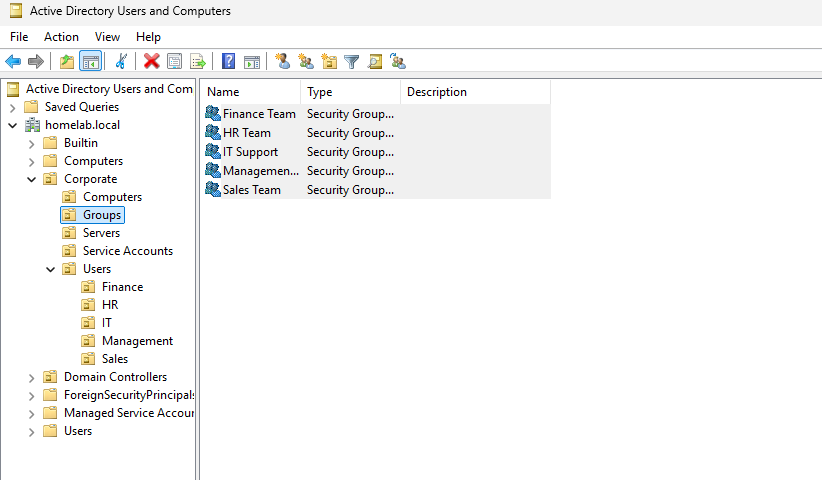
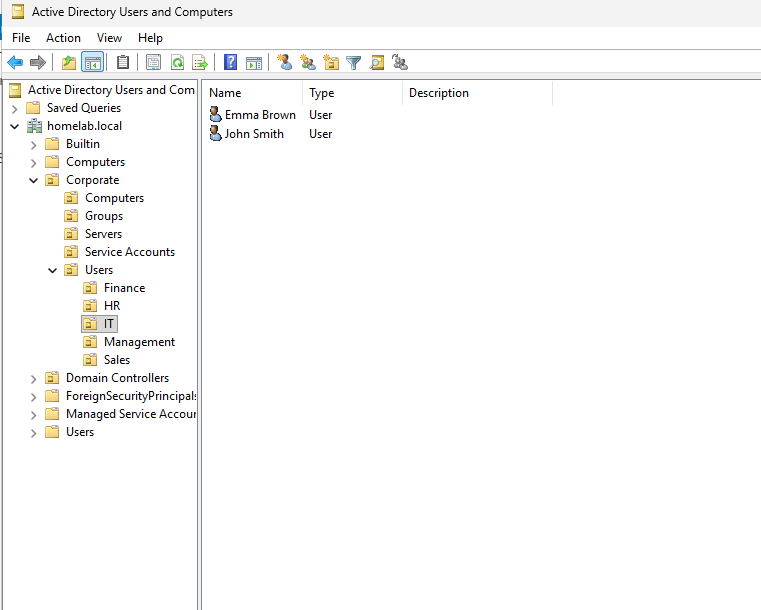

# Users and Groups

## Objective

Organize the Active Directory environment following a departmental structure.

---

## Organizational Units (OUs)

The following Organizational Units were created:

- Corporate
- Computers
- Servers
- Service Accounts
- Users
- Groups

The default Active Directory structure after promoting the server.

A Corporate Organizational Unit was created to organize the environment.

Departmental OUs were created inside the Users container:

- IT
- HR
- Finance
- Sales

Final Organizational Unit structure.

---

## Security Groups

The following security groups were created:

- IT Support
- HR Team
- Finance Team
- Sales Team

Security groups were created to simplify permission management.

---

## Users

Example users were created for each department and assigned to their corresponding security group.

Examples:

- John Smith (IT)
- Sarah Wilson (HR)
- Finance User
- Sales User

The first Active Directory user created.

Final domain users created for each department.

---

## Result

Users and groups were successfully organized following a standard enterprise structure.