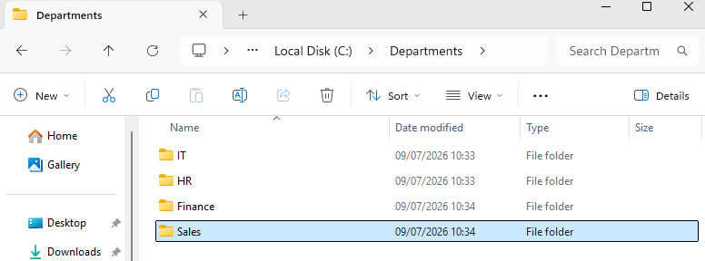
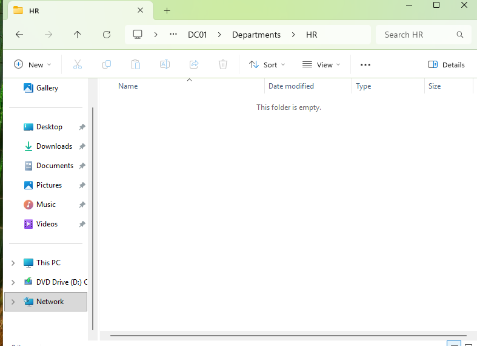
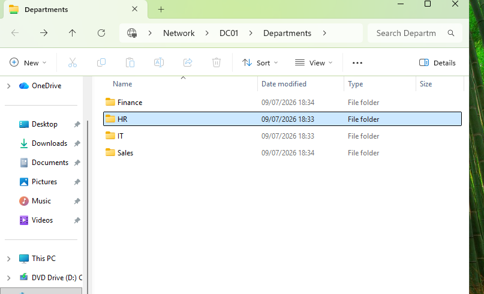

# File Server

## Objective

Deploy a departmental file server secured using NTFS permissions and Active Directory security groups.

---

## Shared Folder

The following shared folder was created:

```text
C:\Departments
```

Inside the shared folder, departmental folders were created:

- IT
- HR
- Finance
- Sales

The following screenshot shows the departmental folder structure.



---

## Permissions

Access was controlled using Active Directory security groups.

Each department was granted Modify permissions only on its own folder.

Examples:

- IT Support → IT
- HR Team → HR
- Finance Team → Finance
- Sales Team → Sales

---

## Validation

Access was tested using different domain users.

Results:

- IT users could access only the IT folder.
- HR users could access only the HR folder.
- Unauthorized access was denied.

The following screenshot shows a HR user successfully accessing the HR shared folder.



The following screenshot shows NTFS permissions correctly denying unauthorized access.



---

## Result

Departmental file access was successfully secured using NTFS permissions.