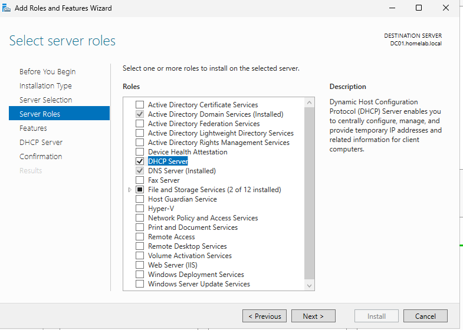
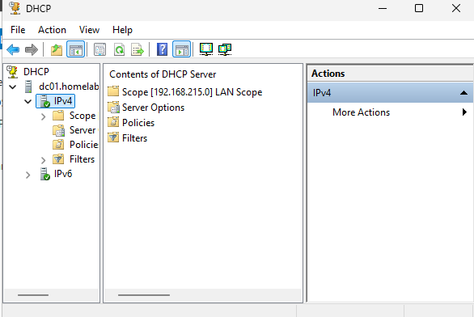
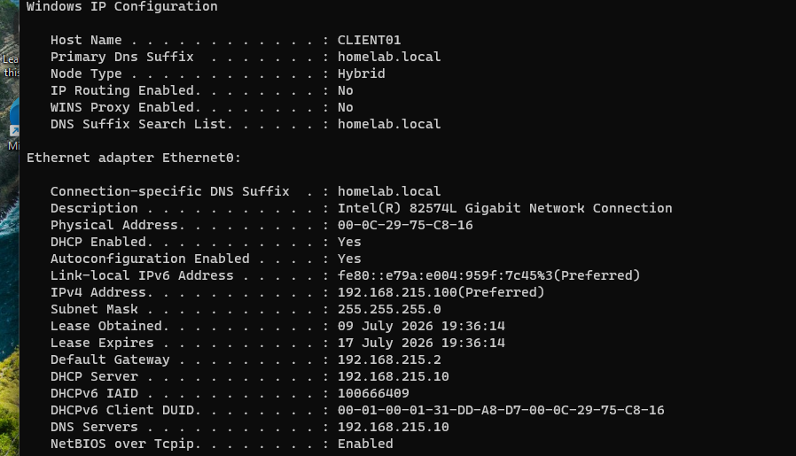
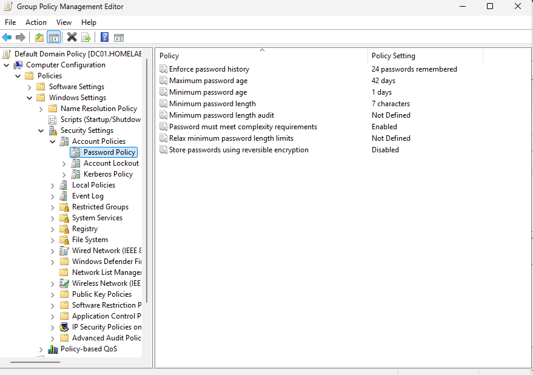
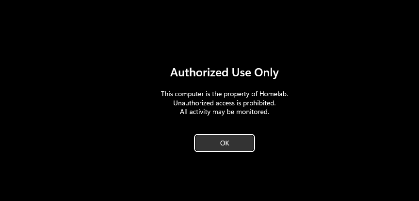

# DHCP and Group Policy

## DHCP Configuration

The DHCP Server role was installed on DC01.

The following screenshot shows the DHCP Server role installed.

A DHCP Scope was configured with the following settings:

- Scope Name: LAN Scope
- Network: 192.168.215.0/24
- IP Range: 192.168.215.100 – 192.168.215.200
- Gateway: 192.168.215.2
- DNS Server: 192.168.215.10

The following screenshot shows the configured DHCP Scope.

The Windows 11 client successfully obtained its IP address from the Domain Controller.

---

## Password Policy

The Default Domain Policy was configured with:

- Minimum password length: 10 characters
- Password complexity: Enabled
- Password history: 5 passwords
- Maximum password age: 90 days

The following screenshot shows the configured password policy.

---

## Group Policy

A custom Group Policy Object named **Corporate Login Banner** was created.

The policy displays a legal notice before users log on.

The following screenshot shows the login banner displayed before user authentication.

---

## Result

The client successfully received DHCP configuration and applied Group Policy settings.