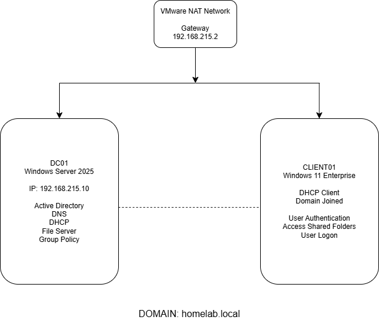
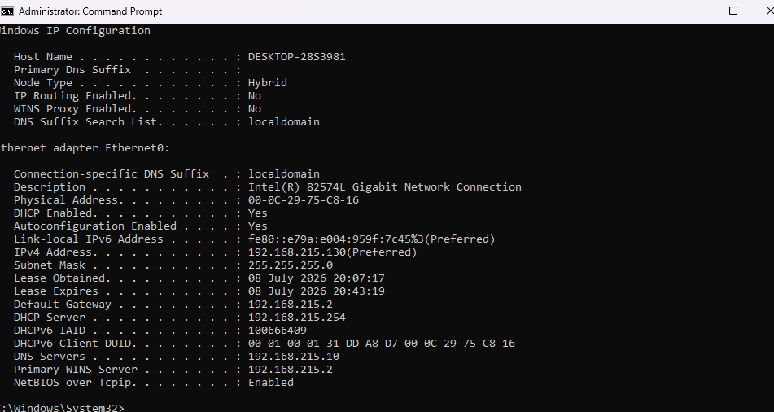

# Active Directory Home Lab

## Overview

This project demonstrates the deployment of a complete Windows Server 2025 Active Directory lab using VMware Workstation.

The environment includes a Domain Controller, DNS, DHCP, Group Policy Objects (GPOs), shared folders secured with NTFS permissions, and a Windows 11 Enterprise client joined to the domain.

The objective of this lab was to simulate a small business environment and gain hands-on experience with common Windows Server administration tasks.

---

## Technologies Used

- Windows Server 2025 Standard
- Windows 11 Enterprise
- VMware Workstation
- Active Directory Domain Services (AD DS)
- DNS
- DHCP
- Group Policy (GPO)
- NTFS Permissions
- SMB File Sharing

---

## Lab Architecture

- **Domain:** homelab.local
- **Domain Controller:** DC01
- **Client:** CLIENT01
- **Server IP:** 192.168.215.10
- **Network:** NAT (VMware)

---

# Deployment Screenshots

## Windows Server Installation

---

## Initial Server Configuration

---

## Active Directory Installation

---

## Active Directory Organization

---

## File Server

---

## DHCP

---

## Client Configuration

---

## Group Policy

---

## Skills Demonstrated

- Windows Server Administration
- Active Directory Management
- User and Group Administration
- DNS Configuration
- DHCP Configuration
- Group Policy Management
- NTFS Permission Management
- Troubleshooting
- Windows Client Administration

---

## Project Status

✅ Completed